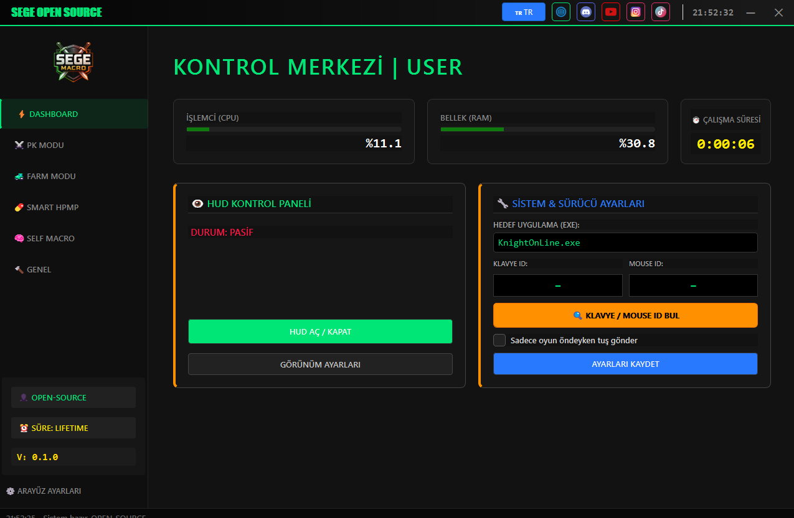

# SEGE Open Source

---

## English

**SEGE Open Source** is an educational, PyQt5-based macro framework that demonstrates how to build a modular automation tool for Windows. It uses the open-source Interception driver for kernel-mode input and exposes a tabbed GUI where each automation module ships as a self-contained `Macro` + `Widget` pair.

The project targets developers who want to learn about Qt widget architecture, Windows input automation, threading patterns, and screen-template matching. The example domain it ships with is the Knight Online MMO, but the underlying framework is game-agnostic and can be adapted to any input-driven workflow.

See [README_EN.md](README_EN.md) for the full English documentation, or [README_TR.md](README_TR.md) for Turkish.

---

## Türkçe

**SEGE Open Source**, Windows için modüler bir otomasyon aracının nasıl inşa edileceğini gösteren, eğitim amaçlı, PyQt5 tabanlı bir makro çatısıdır. Kernel modu giriş için açık kaynak Interception sürücüsünü kullanır ve her otomasyon modülünün kendi `Macro` + `Widget` ikilisini taşıdığı sekmeli bir GUI sunar.

Proje; Qt widget mimarisi, Windows giriş otomasyonu, threading desenleri ve ekran şablonu eşleştirme konularını öğrenmek isteyen geliştiricilere yöneliktir. Örnek alan olarak Knight Online MMO ile birlikte gelir, ancak alttaki çatı oyundan bağımsızdır ve giriş tabanlı herhangi bir iş akışına uyarlanabilir.

Tam Türkçe dokümantasyon için [README_TR.md](README_TR.md), İngilizce için [README_EN.md](README_EN.md) dosyalarına bakın.

---

## Screenshot

> _Place a screenshot of the main window at `assets/screenshot.png`._

---

> ⚠️ **Educational use only.** Automating input in online games may violate their Terms of Service and result in account bans. The authors and contributors accept no responsibility for misuse.
>
> ⚠️ **Yalnızca eğitim amaçlı.** Çevrimiçi oyunlarda giriş otomasyonu kullanmak Kullanım Koşullarını ihlal edebilir ve hesap banına yol açabilir. Yazarlar ve katkıda bulunanlar kötüye kullanımdan sorumlu tutulamaz.

---

## License

Released under the [MIT License](LICENSE). See [CONTRIBUTING.md](CONTRIBUTING.md) for how to contribute and [CODE_OF_CONDUCT.md](CODE_OF_CONDUCT.md) for community guidelines.
